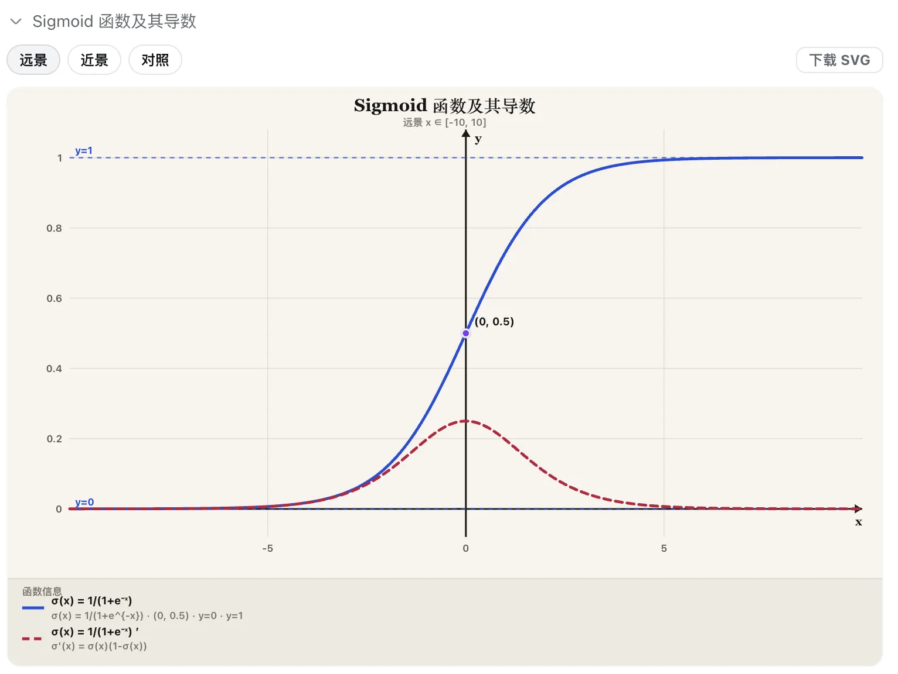

# dsh-function-plot



## 安装

**npm（推荐）**

```sh
dsh plugin --profile web add dsh-function-plot
dsh web
```

**源码**

```sh
git clone https://github.com/kirineko/dsh-function-plot.git
cd dsh-function-plot
pnpm install
pnpm build
dsh plugin --profile web add "$(pwd)"
```

`pnpm ≥10` 若 `add` 失败，写入 `~/.dsh/profiles/web/pnpm-workspace.yaml` 后重试：

```yaml
allowBuilds:
  dsh-function-plot: true
```

## 使用

| 目的 | 说法 |
| --- | --- |
| 画函数 | 画 sigmoid；对比 ReLU 和 GELU；画 y = x^2 / 2 |
| 显示已有 SVG | 把 `figures/arch.svg` 显示在对话里 |

- 标准模式：独立卡片
- PTC：`run_code` 下的嵌套卡片
- 函数图：远景 / 近景 / 对照、函数信息、下载
- 文件：`.dsh-plots/*.svg`

## 卸载

```sh
dsh plugin --profile web remove dsh-function-plot
```

## 配置（可选）

默认即可使用，一般不用改。只有要换输出目录、采样数、画布或主题时，才编辑 `~/.dsh/profiles/web/cordis.patch.yml`：

```yaml
- id: function-plot
  name: dsh-function-plot
  config:
    outputDir: .dsh-plots
    samples: 400
    width: 960
    height: 540
    theme: light
```
